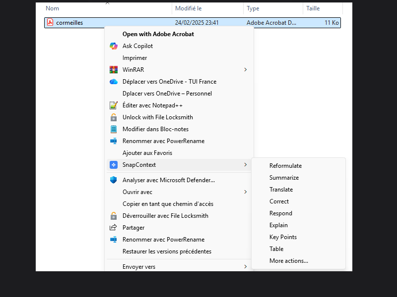
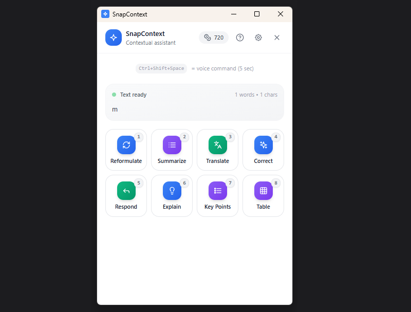
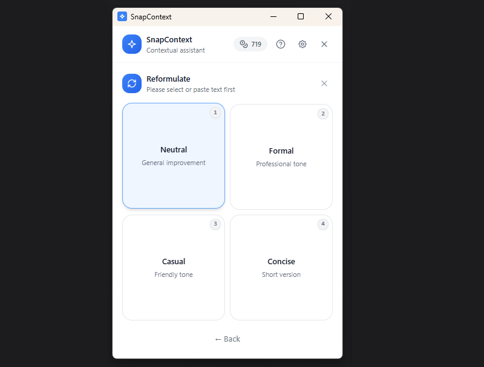
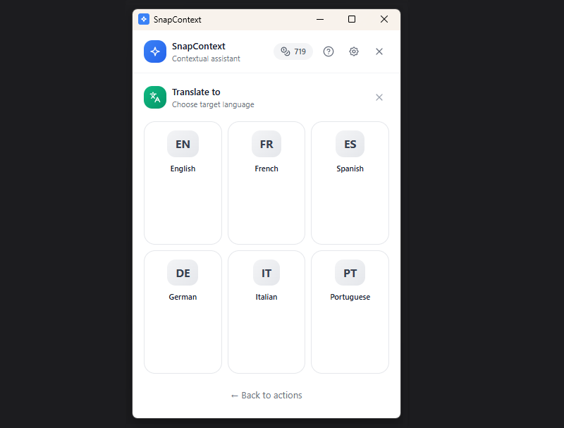
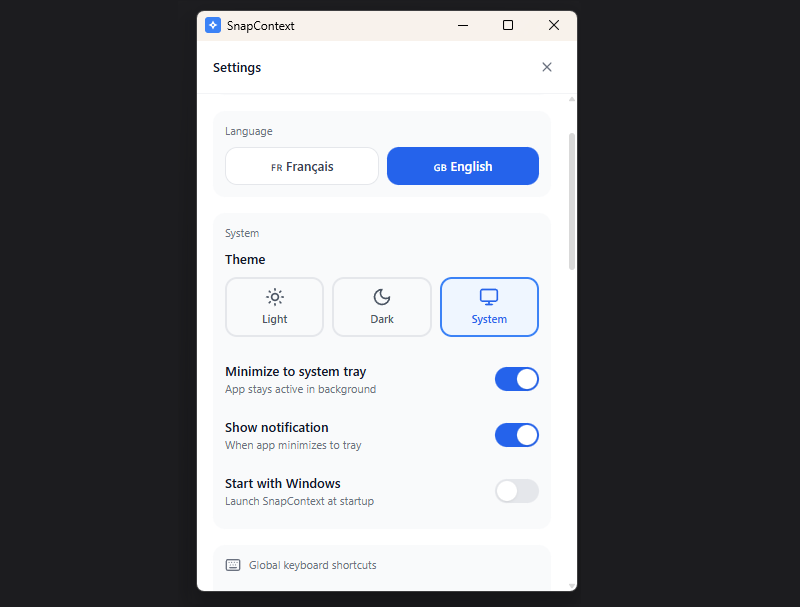
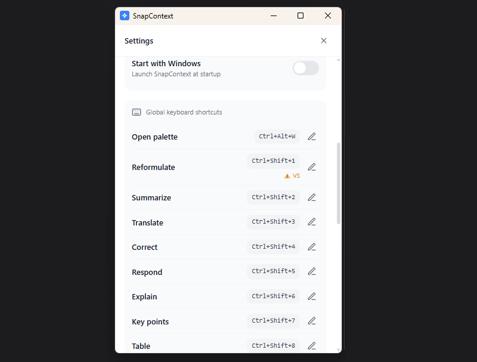

# SnapContext

### 🇫🇷 Français | [🇬🇧 English](#english)

---

### **Arrêtez de copier-coller dans ChatGPT.**

# Sélectionnez un texte. Un raccourci. L'IA répond instantanément.

9 actions IA intégrées nativement dans Windows — clic droit, raccourcis clavier ou commande vocale.
**Zéro changement de contexte.**

 

[🌐 Site officiel](https://snapcontext.io) · [👤 Créer un compte](https://getappsuite.com) · [💳 Gérer mon abonnement](https://getappsuite.com)

---

## 🎬 Voir en action (30s)

*Cliquez pour voir la vidéo de démonstration*

---

## ⚡ Avant / Après — Le gain est immédiat

| Scénario | ❌ Sans SnapContext | ✅ Avec SnapContext |
|:---------|:---:|:---:|
| Répondre à un email pro | ~2 min, copier dans ChatGPT, reformuler, coller | **~15 sec**, clic droit → Répondre |
| Résumer un PDF de 20 pages | ~5 min, copier par morceaux | **~10 sec**, clic droit sur le fichier |
| Traduire un message Slack | ~30 sec, ouvrir Google Translate | **~3 sec**, `Ctrl+Shift+3` |
| Corriger un rapport | ~3 min, relecture manuelle | **~5 sec**, `Ctrl+Shift+4` |
| Expliquer du code technique | ~2 min, prompt ChatGPT | **~5 sec**, `Ctrl+Shift+6` |

### 💡 Gagnez jusqu'à 45 min/jour sur vos communications.

---

## 🖱️ Intégration native Windows — Pas juste un chatbot de plus

*SnapContext s'intègre directement dans le menu clic droit de Windows — sur du texte ET sur des fichiers.*

---

## ✨ 9 Super-pouvoirs IA

<table>
<tr>
<td width="50%">

### ✨ Reformuler `Ctrl+Shift+1`
Transformez un brouillon en texte professionnel. 5 styles : formel, décontracté, concis, détaillé, créatif.

### 📋 Résumer `Ctrl+Shift+2`
L'essentiel d'un long document en quelques lignes. 4 formats : standard, bullet, TL;DR, exécutif.

### 🌍 Traduire `Ctrl+Shift+3`
10+ langues avec préservation du contexte et du ton.

### ✓ Corriger `Ctrl+Shift+4`
Orthographe, grammaire, ponctuation, style — tout est corrigé.

### 💬 Répondre `Ctrl+Shift+5`
Générez une réponse avec le bon ton : professionnel, amical, empathique, assertif, personnalisé.

</td>
<td width="50%">

### 📚 Expliquer `Ctrl+Shift+6`
Simplifiez n'importe quel concept à 5 niveaux : Expert → Enfant.

### • Points clés `Ctrl+Shift+7`
Extrayez les idées principales en liste structurée et hiérarchisée.

### 📊 Tableau `Ctrl+Shift+8`
Organisez automatiquement des données en tableau clair et lisible.

### 🎯 Instruction libre `Ctrl+Shift+9`
Donnez votre propre instruction à l'IA. Transformez en poème, convertissez du code, ajoutez des emojis...

### 🎙️ Commande vocale `Ctrl+Shift+Space`
Parlez naturellement : *"Résume ce texte"*, *"Traduis en anglais"*, *"Corrige les fautes"*

</td>
</tr>
</table>

---

## 🎮 3 Façons d'utiliser SnapContext

| 🖱️ **Clic Droit** | ⌨️ **Palette Magique** | 🔢 **Raccourcis Directs** |
|:---:|:---:|:---:|
| Sélectionnez → Clic droit → SnapContext | `Ctrl+Alt+W` depuis n'importe où | `Ctrl+Shift+1` à `Ctrl+Shift+9` |
| *Fonctionne sur texte ET fichiers* | *Copie auto du texte sélectionné* | *Action instantanée* |

### 📄 Formats de fichiers supportés

- **Documents** : PDF, DOCX, TXT, MD, RTF
- **Données** : JSON, XML, YAML, CSV
- **Code** : JS, TS, PY, RS, GO, JAVA, C#, PHP, HTML, CSS...
- **Fichiers jusqu'à 20 Mo** avec traitement parallèle (3 segments simultanés)

---

## 🏆 Comparaison avec les alternatives

| Fonctionnalité | SnapContext | ChatGPT | Grammarly | Rewrait | PowerToys |
|:---|:---:|:---:|:---:|:---:|:---:|
| Menu clic droit natif Windows | ✅ | ❌ | ❌ | ❌ | ❌ |
| Raccourcis clavier globaux | ✅ | ❌ | ❌ | ✅ | ✅ |
| Commande vocale | ✅ | ❌ | ❌ | ❌ | ❌ |
| Traitement de fichiers (PDF, DOCX) | ✅ | ❌ | ❌ | ❌ | ❌ |
| 9 actions IA préconfigurées | ✅ | ❌ | ❌ | ~3 | ❌ |
| Fonctionne dans TOUTES les apps Windows | ✅ | ❌ | Navigateur | ✅ | ✅ |
| Mode résident systray | ✅ | ❌ | ✅ | ✅ | ❌ |
| Plan gratuit | ✅ | Limité | Basique | ❌ | ✅ |
| Aucune configuration API requise | ✅ | N/A | ✅ | ❌ | N/A |
| RGPD / Données en UE | ✅ | ❌ | ❌ | ❌ | N/A |

### 💰 Et le prix ?

| Solution | Prix mensuel | Comparaison |
|:---|:---:|:---|
| **SnapContext Starter** | **6,99 €** | — |
| Rewrait | ~9 € | 30% plus cher |
| ChatGPT Plus | ~20 € | **170% plus cher** |
| Grammarly Premium | ~25 € | **300% plus cher** |

---

## 🔧 Intégration Windows parfaite

<table>
<tr>
<td width="50%">

### 🔽 Mode résident
- Tourne silencieusement en arrière-plan
- **~15 Mo RAM**, 0% CPU au repos
- Icône systray avec compteur de crédits

### 🚀 Démarrage automatique
- Lancement optionnel avec Windows
- Toujours prêt quand vous en avez besoin

### 🎨 Thème adaptatif
- Suit le thème clair/sombre de Windows
- Mode clair, sombre ou automatique

</td>
<td width="50%">

### ⌨️ Raccourcis personnalisables
- Modifiez tous les raccourcis
- Support du pavé numérique
- Détection de conflits

### 🔄 Mises à jour auto
- Notification discrète
- Installation en un clic
- Pas de désinstallation manuelle

### 🌐 Bilingue FR/EN
- Interface 100% traduite
- Détection automatique de la langue

</td>
</tr>
</table>

---

## 🔒 Sécurité & Confidentialité

| 🇫🇷 **Made in France** | 🇪🇺 **RGPD Conforme** | 🔐 **Données en UE** | 🧠 **IA Éthique** |
|:---:|:---:|:---:|:---:|
| Éditeur français (Wiscale) | Engagements contractuels RGPD | Hébergement européen chiffré | Textes non utilisés pour l'entraînement |

- ✅ **Application native Rust** — pas d'Electron, plus sécurisé et performant
- ✅ **Chiffrement HTTPS** end-to-end pour toutes les communications
- ✅ **Aucun stockage** — vos textes sont supprimés immédiatement après traitement
- ✅ **Aucune donnée personnelle** collectée ou partagée
- ✅ **Désinstallation propre** — aucune trace laissée sur votre système

---

## 📥 Installation en 2 minutes

1. **Téléchargez** la dernière version ci-dessus
2. **Exécutez** `SnapContext_x64-setup.exe`
3. **SmartScreen** : Cliquez *"Informations complémentaires"* → *"Exécuter quand même"*
   > C'est normal pour les nouvelles applications Windows. SnapContext est signé et sécurisé.
4. **Créez votre compte** directement dans l'application (gratuit, 50 crédits offerts)
5. **C'est prêt !** Appuyez sur `Ctrl+Alt+W` ou faites un clic droit sur du texte

> 💡 **Mise à jour ?** Lancez simplement le nouvel installateur — il remplace automatiquement l'ancienne version.

---

## 💳 Tarification simple & transparente

| Plan | Prix | Crédits/mois | Idéal pour |
|:---:|:---:|:---:|:---|
| 🆓 **Free** | **0 €** | 50 | Découvrir SnapContext |
| ⭐ **Starter** | 6,99 €/mois | 500 | Usage quotidien modéré |
| 🚀 **Pro** | 14,99 €/mois | 2 000 | Professionnels & équipes |
| ♾️ **Unlimited** | 29,99 €/mois | Illimité | Usage intensif |

**1 crédit = 1 action IA** (reformuler, traduire, résumer, etc.)

### 🔋 Recharges Boost (non expirables)

| Pack | Prix |
|:---:|:---:|
| 100 crédits | 2,99 € |
| 500 crédits | 9,99 € |
| 2 000 crédits | 29,99 € |

👉 [**Gérer mon abonnement**](https://getappsuite.com)

---

## ❓ FAQ

<b>SnapContext est-il gratuit ?</b>

Oui ! Le plan Free offre 50 crédits/mois, renouvelés automatiquement. Suffisant pour découvrir toutes les fonctionnalités.

<b>Fonctionne-t-il hors ligne ?</b>

Non, une connexion internet est nécessaire pour les traitements IA. L'application elle-même tourne hors ligne mais les actions nécessitent internet.

<b>Mes textes sont-ils stockés ?</b>

Jamais. Vos textes sont envoyés pour traitement et immédiatement supprimés. Nous ne conservons aucun contenu. Conforme RGPD.

<b>Puis-je l'utiliser sur plusieurs PC ?</b>

Oui ! Votre compte est lié à votre email, pas à votre machine. Installez SnapContext sur autant de PC Windows que vous voulez.

<b>Quelle différence avec ChatGPT ?</b>

SnapContext est intégré nativement dans Windows. Pas besoin d'ouvrir un navigateur, de copier-coller, de rédiger un prompt. Sélectionnez, raccourci, c'est fait. En 3 secondes au lieu de 2 minutes.

<b>SmartScreen bloque l'installation ?</b>

C'est normal pour les nouvelles applications. Cliquez "Informations complémentaires" puis "Exécuter quand même". SnapContext est une application signée et sécurisée.

<b>Est-ce un logiciel français ?</b>

Oui ! SnapContext est développé par Wiscale, éditeur français. Données hébergées en UE, conforme RGPD, support en français.

<b>Comment fonctionnent les commandes vocales ?</b>

Appuyez sur <code>Ctrl+Shift+Space</code>, parlez naturellement ("Résume ce texte", "Traduis en anglais"), et l'action se lance automatiquement. Reconnaissance multilingue FR/EN.

---

## 📞 Support & Contact

| 📧 Email | 🌐 Site | 👤 Compte |
|:---:|:---:|:---:|
| [support@wiscale.fr](mailto:support@wiscale.fr) | [snapcontext.io](https://snapcontext.io) | [getappsuite.com](https://getappsuite.com) |

---

# SnapContext

### [🇫🇷 Français](#) | 🇬🇧 English

---

### **Stop copying text into ChatGPT.**

# Select any text. One shortcut. AI responds instantly.

9 AI actions natively integrated into Windows — right-click, keyboard shortcuts, or voice command.
**Zero context switching.**

 

[🌐 Official website](https://snapcontext.io) · [👤 Create account](https://getappsuite.com) · [💳 Manage subscription](https://getappsuite.com)

---

## 🎬 See it in action (30s)

*Click to watch the demo video*

---

## ⚡ Before / After — The difference is immediate

| Scenario | ❌ Without SnapContext | ✅ With SnapContext |
|:---------|:---:|:---:|
| Reply to a professional email | ~2 min, copy to ChatGPT, rephrase, paste | **~15 sec**, right-click → Reply |
| Summarize a 20-page PDF | ~5 min, copy chunks | **~10 sec**, right-click on file |
| Translate a Slack message | ~30 sec, open Google Translate | **~3 sec**, `Ctrl+Shift+3` |
| Proofread a report | ~3 min, manual review | **~5 sec**, `Ctrl+Shift+4` |
| Explain technical code | ~2 min, ChatGPT prompt | **~5 sec**, `Ctrl+Shift+6` |

### 💡 Save up to 45 min/day on your communications.

---

## 🖱️ Native Windows integration — Not just another chatbot

*SnapContext integrates directly into the Windows right-click menu — on text AND files.*

---

## ✨ 9 AI Super-powers

<table>
<tr>
<td width="50%">

### ✨ Reformulate `Ctrl+Shift+1`
Transform drafts into professional text. 5 styles: formal, casual, concise, detailed, creative.

### 📋 Summarize `Ctrl+Shift+2`
Get the essence of long documents. 4 formats: standard, bullet, TL;DR, executive.

### 🌍 Translate `Ctrl+Shift+3`
10+ languages with context and tone preservation.

### ✓ Correct `Ctrl+Shift+4`
Spelling, grammar, punctuation, style — all fixed automatically.

### 💬 Reply `Ctrl+Shift+5`
Generate responses with the right tone: professional, friendly, empathetic, assertive, custom.

</td>
<td width="50%">

### 📚 Explain `Ctrl+Shift+6`
Simplify any concept at 5 levels: Expert → Child.

### • Key Points `Ctrl+Shift+7`
Extract main ideas as a structured, hierarchical list.

### 📊 Table `Ctrl+Shift+8`
Automatically organize data into a clear, readable table.

### 🎯 Custom Instruction `Ctrl+Shift+9`
Give your own instruction to the AI. Turn into a poem, convert code, add emojis...

### 🎙️ Voice Command `Ctrl+Shift+Space`
Speak naturally: *"Summarize this"*, *"Translate to French"*, *"Fix the errors"*

</td>
</tr>
</table>

---

## 🎮 3 Ways to Use SnapContext

| 🖱️ **Right-Click** | ⌨️ **Magic Palette** | 🔢 **Direct Shortcuts** |
|:---:|:---:|:---:|
| Select → Right-click → SnapContext | `Ctrl+Alt+W` from anywhere | `Ctrl+Shift+1` to `Ctrl+Shift+9` |
| *Works on text AND files* | *Auto-copies selected text* | *Instant action* |

### 📄 Supported file formats

- **Documents**: PDF, DOCX, TXT, MD, RTF
- **Data**: JSON, XML, YAML, CSV
- **Code**: JS, TS, PY, RS, GO, JAVA, C#, PHP, HTML, CSS...
- **Files up to 20 MB** with parallel processing (3 simultaneous segments)

---

## 🏆 Comparison with alternatives

| Feature | SnapContext | ChatGPT | Grammarly | Rewrait | PowerToys |
|:---|:---:|:---:|:---:|:---:|:---:|
| Native Windows right-click menu | ✅ | ❌ | ❌ | ❌ | ❌ |
| Global keyboard shortcuts | ✅ | ❌ | ❌ | ✅ | ✅ |
| Voice command | ✅ | ❌ | ❌ | ❌ | ❌ |
| File processing (PDF, DOCX) | ✅ | ❌ | ❌ | ❌ | ❌ |
| 9 preconfigured AI actions | ✅ | ❌ | ❌ | ~3 | ❌ |
| Works in ALL Windows apps | ✅ | ❌ | Browser | ✅ | ✅ |
| Systray resident mode | ✅ | ❌ | ✅ | ✅ | ❌ |
| Free plan | ✅ | Limited | Basic | ❌ | ✅ |
| No API configuration needed | ✅ | N/A | ✅ | ❌ | N/A |
| GDPR / Data in EU | ✅ | ❌ | ❌ | ❌ | N/A |

### 💰 Pricing comparison

| Solution | Monthly price | Comparison |
|:---|:---:|:---|
| **SnapContext Starter** | **$6.99** | — |
| Rewrait | ~$9 | 30% more expensive |
| ChatGPT Plus | ~$20 | **170% more expensive** |
| Grammarly Premium | ~$25 | **300% more expensive** |

---

## 🔧 Perfect Windows Integration

<table>
<tr>
<td width="50%">

### 🔽 Resident Mode
- Runs silently in background
- **~15 MB RAM**, 0% CPU idle
- Systray icon with credit counter

### 🚀 Auto-Start
- Optional launch with Windows
- Always ready when you need it

### 🎨 Adaptive Theme
- Follows Windows light/dark theme
- Light, dark, or automatic mode

</td>
<td width="50%">

### ⌨️ Customizable Shortcuts
- Modify all hotkeys
- Numpad support
- Conflict detection

### 🔄 Auto-Updates
- Discrete notification
- One-click installation
- No manual uninstall needed

### 🌐 Bilingual FR/EN
- 100% translated interface
- Automatic language detection

</td>
</tr>
</table>

---

## 🔒 Security & Privacy

| 🇫🇷 **Made in France** | 🇪🇺 **GDPR Compliant** | 🔐 **Data in EU** | 🧠 **Ethical AI** |
|:---:|:---:|:---:|:---:|
| French publisher (Wiscale) | GDPR contractual commitments | Encrypted European hosting | Texts never used for training |

- ✅ **Native Rust application** — not Electron, more secure and performant
- ✅ **HTTPS encryption** end-to-end for all communications
- ✅ **No storage** — your texts are deleted immediately after processing
- ✅ **No personal data** collected or shared
- ✅ **Clean uninstall** — no traces left on your system

---

## 📥 Install in 2 minutes

1. **Download** the latest version above
2. **Run** `SnapContext_x64-setup.exe`
3. **SmartScreen**: Click *"More info"* → *"Run anyway"*
   > This is normal for new Windows apps. SnapContext is signed and secure.
4. **Create your account** directly in the app (free, 50 credits included)
5. **Ready!** Press `Ctrl+Alt+W` or right-click on any text

> 💡 **Updating?** Just run the new installer — it automatically replaces the old version.

---

## 💳 Simple & Transparent Pricing

| Plan | Price | Credits/month | Best for |
|:---:|:---:|:---:|:---|
| 🆓 **Free** | **$0** | 50 | Discover SnapContext |
| ⭐ **Starter** | $6.99/mo | 500 | Moderate daily use |
| 🚀 **Pro** | $14.99/mo | 2,000 | Professionals & teams |
| ♾️ **Unlimited** | $29.99/mo | Unlimited | Heavy use |

**1 credit = 1 AI action** (reformulate, translate, summarize, etc.)

### 🔋 Boost Packs (never expire)

| Pack | Price |
|:---:|:---:|
| 100 credits | $2.99 |
| 500 credits | $9.99 |
| 2,000 credits | $29.99 |

👉 [**Manage subscription**](https://getappsuite.com)

---

## ❓ FAQ

<b>Is SnapContext free?</b>

Yes! The Free plan includes 50 credits/month, automatically renewed. Enough to discover all features.

<b>Does it work offline?</b>

No, an internet connection is required for AI processing. The app itself runs offline but actions need internet.

<b>Are my texts stored?</b>

Never. Your texts are sent for processing and immediately deleted. We store no content. GDPR compliant.

<b>Can I use it on multiple PCs?</b>

Yes! Your account is tied to your email, not your machine. Install SnapContext on as many Windows PCs as you want.

<b>How is it different from ChatGPT?</b>

SnapContext is natively integrated into Windows. No browser, no copy-paste, no prompt writing. Select, shortcut, done. 3 seconds instead of 2 minutes.

<b>SmartScreen blocks installation?</b>

This is normal for new applications. Click "More info" then "Run anyway". SnapContext is a signed and secure application.

<b>Is it French software?</b>

Yes! SnapContext is developed by Wiscale, a French publisher. Data hosted in EU, GDPR compliant, support in French and English.

<b>How do voice commands work?</b>

Press <code>Ctrl+Shift+Space</code>, speak naturally ("Summarize this text", "Translate to French"), and the action launches automatically. Multilingual FR/EN recognition.

---

## 📞 Support & Contact

| 📧 Email | 🌐 Website | 👤 Account |
|:---:|:---:|:---:|
| [support@wiscale.fr](mailto:support@wiscale.fr) | [snapcontext.io](https://snapcontext.io) | [getappsuite.com](https://getappsuite.com) |

---

**© 2025 [Wiscale](https://wiscale.fr)** — All rights reserved

Made with ❤️ in France

